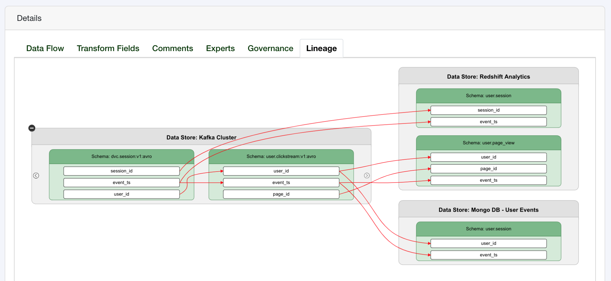

===========================
 Tree Schema Python Client
===========================

:Version: 1.0.0
:Documentation: https://developer.treeschema.com/python-client
:Download: https://pypi.org/project/treeschema
:Source: https://github.com/tree-schema/tree-schema-python
:Keywords: data lineage, metadata

You ETL/ELT processes are diverse, your pipelines are serverless - the Tree Schema Python client aims to provide you the flexibility to integrate into any ecosystem!

What You Can Do
---------------

The **Tree Schema** library is a simple interface that enables data creators and data users to manage their `Tree Schema Data Catalog <https://treeschema.com>`_ as code. The Tree Schema library enables you to:

- Manage data lineage as code
- Capture the values of your fields and their definitions
- Explore your catalog in the same notebook as your data analysis

Here are a few quick snippets:

Manage Your Data Lineage as Code
--------------------------------
.. sourcecode:: python

   # Import Tree Schema
   from treeschema import TreeSchema
   ts = TreeSchema('<your email>', '<your secret key>')

   # Define the source and target fields 
   src_field = ts.data_store('Kafka Cluster').schema('dvc.user:v1').field('user_id')
   tgt_field = ts.data_store('Kafka Cluster ').schema('usr.clickstream:v1').field('user_id')
   link = (src_field, tgt_field)

   # Select your transformation
   t = ts.transformation('Kafka Pub-Sub')

   # Create the data lineage
   t.create_links(link)

The complexity of your transformation is only limited by your own imagination. Data lineage can be explored within the Tree Schema GUI
once created, a slightly more complex example may look like:

 

Create Definitions for Field Values
-----------------------------------
.. sourcecode:: python

   # Import Tree Schema
   from treeschema import TreeSchema
   ts = TreeSchema('<your email>', '<your secret key>')

   # Select the field to add sample values to
   src_field = ts.data_store('Kafka Cluster').schema('dvc.user:v1').field('user_status')
   
   # Define the value and it's definition 
   sample_value = {
      'field_value': '02',
      'description': 'User has converted from lead to customer'
   }
   field.field_value(sample_value)

How to Get Started
------------------
Make sure you sign up for Tree Schema - it's completely free to sign up with no card required - and follow the instructions for `how to get your secret key <https://help.treeschema.com/api/api_access.html>`_ .

Check out all of the `Examples <https://developer.treeschema.com/python-client/examples/examples.html>`_ in the documentation to see all of the library features and to explore more in-depth and complex use-cases.

Have Questions or Need Help?
----------------------------
Shoot an email to **developer@treeschema.com** to get help integrating Tree Schema.