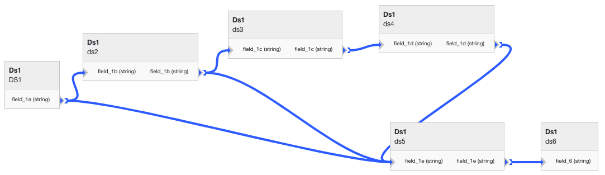

Detect Data Lineage Breaking Changes
====================================

Once you have captured your data lineage in Tree Schema you have the ability
to check the potential impact to your downstream pipelines and workflows whenever you 
make a change to your data lineage. Tree Schema will tell you if the changes 
you are planning to make will be a breaking change and, if so, what data 
assets are impacted as well as the full lineage for those downstream assets.

.. note:: Tree Schema's defintion of a *breaking* change is when a connection 
   between two fields is removed. 

Identify Breaking Changes
-------------------------

When you are checking for a breaking change wihtin Tree Schema you will be comparing
the *state* of your transform links from the *current* state to a *potential* state.
You will provide the *potential* state to Tree Schema and Tree Schema will compare it 
to the existing state to determine the differences. 

In this example we will walk through the full lifecycle to create data lineage, make 
a hypothetical change and then compare that hypothetical change to the existing data 
lineage to see if there is an impact.

.. code-block:: python

   from treeschema import TreeSchema
   ts = TreeSchema('<your email>', '<your secret key>')

   # Create a brand new transformation
   transforma_inputs = {
      'name': 'My Breaking Change Transform', 
      'type': 'pub_sub_event'
   }
   t = ts.transformation(transforma_inputs)

   # Create some transformation links (note - these fields already exist)
   transform_links = [ 
      ({'source_field_id': 2, 'target_field_id': 3}),
      ({'source_field_id': 3, 'target_field_id': 4}),
      ({'source_field_id': 4, 'target_field_id': 5})
   ]

   # Create data lineage by adding the links to the transformation
   t.set_links_state(transform_links)

   ##############################
   # Check for breaking changes #
   ##############################
   # Remove one of the links to see if there is a breaking change
   # Notice that field 2 -> field 3 has been removed
   new_link_state = [ 
      ({'source_field_id': 3, 'target_field_id': 4}),
      ({'source_field_id': 4, 'target_field_id': 5})
   ]
   
   # Check for breaking changes for this transformation object, ("t")
   li = t.check_breaking_change(link_state=new_link_state)
   li.breaking
   # True

   # For more detail print the full impact details
   print(li.all_impact_strings())
   # Lineage for Each Breaking Change
   # --------------------------------
   # 
   # Data Store: Ds1 (1), Schema: ds3 (3), Field: field_1c (3)
   #    └-->Data Store: Ds1 (1), Schema: ds4 (4), Field: field_1d (4)
   # 
   # -----
   # 
   # Data Store: Ds1 (1), Schema: ds3 (3), Field: field_1c (3)
   #    └-->Data Store: Ds1 (1), Schema: ds4 (4), Field: field_1d (4)
   #       └-->Data Store: Ds1 (1), Schema: ds5 (5), Field: field_1e (5)

In this example we created a breaking change. As seen above, you can print out the 
full lineage of the data assets that are impacted. 

Although this example contains the full data lineage in a single transformation,
Tree Schema will identify these breaking changes across all of your 
transformations. Even if the connection between fields 4 & 5 were saved in a different 
transformation.

Understanding Breaking Changes
------------------------------

Tree Schema assumes that the user implicitly understands that there may be an impact to the 
fields that are connected to any of the transformation links that are being removed.

In the example above there were two fields that were determined to be *broken*, field 4 & 5. 
Since the link between fields *2 -> 3* was removed, Tree Schema assumed that the impact to 
field 3 was understood by the user. However, all other fields that are downstream 
of field 3 are considered broken. In that example, the broken fields included fields 4 & 5.

Looking at a slightly more complicated example. The data lineage below (which was defined 
in the Tree Schema GUI) creates a lineage that contains multiple branches and paths. 
For simplicity, all of the schemas and fields are numbered numerically.

Removing the last link
~~~~~~~~~~~~~~~~~~~~~~

We can first test a basic change by removing a single connection from this transformation.
Here, the link between fields 5 & 6 will be removed. This is the last connection in 
the lineage in the bottom right. 

.. code-block:: python
   
   t = ts.transformation(1)
   links = [ 
      # Upper Lineage Path
      (schema_1.field(1), schema_2.field(2)),
      (schema_2.field(2), schema_3.field(3)),
      (schema_3.field(3), schema_4.field(4)),
      (schema_4.field(4), schema_5.field(5)),
      # (schema_5.field(5), schema_6.field(6)),  -- Remove this connection

      # Lower Lineage Path
      (schema_2.field(2), schema_5.field(5)),
      (schema_1.field(1), schema_5.field(5)),
   ]

   li = t.check_breaking_change(link_state=links)
   li.breaking
   # False

This is not breaking! Tree Schema assumes that as the user we understand 
the implication to the immediate data assets that are connected by the link being removed.
Since there are no downstream data assets there is not a breaking change.

Removing multiple links
~~~~~~~~~~~~~~~~~~~~~~~

.. code-block:: python
   
   t = ts.transformation(1)
   links = [ 
      # Upper Lineage Path
      (schema_1.field(1), schema_2.field(2)),
      # (schema_2.field(2), schema_3.field(3)),  -- Remove this connection
      # (schema_3.field(3), schema_4.field(4)),  -- Remove this connection
      (schema_4.field(4), schema_5.field(5)),
      (schema_5.field(5), schema_6.field(6)),

      # Lower Lineage Path
      (schema_2.field(2), schema_5.field(5)),
      (schema_1.field(1), schema_5.field(5)),
   ]

   li = t.check_breaking_change(link_state=links)
   li.breaking
   # True

   print(li.all_impact_strings())
   # Lineage for Each Breaking Change
   # --------------------------------
   # 
   # Data Store: Ds1 (1), Schema: ds3 (3), Field: field_1c (3)
   #    └-->Data Store: Ds1 (1), Schema: ds4 (4), Field: field_1d (4)
   #       └-->Data Store: Ds1 (1), Schema: ds5 (5), Field: field_1e (5)
   # 
   # -----
   # 
   # Data Store: Ds1 (1), Schema: ds3 (3), Field: field_1c (3)
   #    └-->Data Store: Ds1 (1), Schema: ds4 (4),Field: field_1d (4)
   #       └-->Data Store: Ds1 (1), Schema: ds5 (5), Field: field_1e (5)
   #             └-->Data Store: Ds1 (1), Schema: ds6 (6), Field: field_6 (6)

In this example there are only two broken assets, fields 5 and 6. Again, because 
we explicitly removed links going into fields 3 and 4 Tree Schema will not 
consider those fields to be broken. All of the downstream fields after 4 are 
considered broken. 

Similarly, the inputs into field 2 were not changed, therefore it is not considered 
broken.

Removing the first link
~~~~~~~~~~~~~~~~~~~~~~~

.. code-block:: python
   
   t = ts.transformation(1)
   links = [ 
      # Upper Lineage Path
      # (schema_1.field(1), schema_2.field(2)),  -- Remove this connection
      (schema_2.field(2), schema_3.field(3)),
      (schema_3.field(3), schema_4.field(4)),
      (schema_4.field(4), schema_5.field(5)),
      (schema_5.field(5), schema_6.field(6)),

      # Lower Lineage Path
      (schema_2.field(2), schema_5.field(5)),
      (schema_1.field(1), schema_5.field(5)),
   ]

   li = t.check_breaking_change(link_state=links)
   li.breaking
   # True

   print(li.all_impact_strings())
   # Lineage for Each Breaking Change
   # --------------------------------
   # 
   # Data Store: Ds1 (1), Schema: ds2 (2), , Field: field_1b (2)
   #    └-->Data Store: Ds1 (1), Schema: ds3 (3), , Field: field_1c (3)
   # 
   # -----
   # 
   # Data Store: Ds1 (1), Schema: ds2 (2), , Field: field_1b (2)
   #    └-->Data Store: Ds1 (1), Schema: ds3 (3), , Field: field_1c (3)
   #       └-->Data Store: Ds1 (1), Schema: ds4 (4), , Field: field_1d (4)
   #             └-->Data Store: Ds1 (1), Schema: ds5 (5), , Field: field_1e (5)
   # 
   # -----
   # 
   # Data Store: Ds1 (1), Schema: ds2 (2), , Field: field_1b (2)
   #    └-->Data Store: Ds1 (1), Schema: ds3 (3), , Field: field_1c (3)
   #       └-->Data Store: Ds1 (1), Schema: ds4 (4), , Field: field_1d (4)
   # 
   # -----
   # 
   # Data Store: Ds1 (1), Schema: ds2 (2), , Field: field_1b (2)
   #    └-->Data Store: Ds1 (1), Schema: ds3 (3), , Field: field_1c (3)
   #       └-->Data Store: Ds1 (1), Schema: ds4 (4), , Field: field_1d (4)
   #             └-->Data Store: Ds1 (1), Schema: ds5 (5), , Field: field_1e (5)
   #                └-->Data Store: Ds1 (1), Schema: ds6 (6), , Field: field_6 (6)

In this final example, all of the fields downstream from field 2 are considered broken. 
Even though field 5 also has an input from field 1 that is not changed field 5 is still 
considered broken because a direct upstream path is no longer in tact.

Best Practices to Identify Breaking Changes in Your CICD Pipeline
-----------------------------------------------------------------

The best practice for Tree Schema integration is to place a script in your CICD process 
that generates the current data lineage for your transformations, checks if the change being 
made is a breaking change and then continues or exits the CICD process based on the outcome 
of checking for breaking changes. 

After confirming that a change is not a breaking change 
you can continue to set the state of the transformation to the new value, as seen below:

.. code-block:: python
   
   t = ts.transformation(1)
   links = [ 
      # Upper Lineage Path
      (schema_1.field(1), schema_2.field(2)),
      (schema_2.field(2), schema_3.field(3)),
      (schema_3.field(3), schema_4.field(4)),
      (schema_4.field(4), schema_5.field(5)),
      # (schema_5.field(5), schema_6.field(6)), -- Remove this connection

      (schema_5.field(5), schema_6.field(7)), # -- Replace it with this connection

      # Lower Lineage Path
      (schema_2.field(2), schema_5.field(5)),
      (schema_1.field(1), schema_5.field(5)),
   ]

   li = t.check_breaking_change(link_state=links)
   if li.breaking:
      print(li.all_impact_strings())
      raise Exception('Data lineage has breaking changes')
   else:
      # Only update Tree Schema after confirming no breaking changes
      t.set_links_state(links)

Viewing the Impact from a Breaking Change
-----------------------------------------

Since Tree Schema captures data lineage at the field level you may have an overwhelming 
number of data assets that are impacted by even the smallest breaking change. To 
help provide a more succinct output to you there are several arguments you can use 
when interacting with the Tree Schema API to reduce the clutter.

1. Change the `max_depth` for finding breaking changes.

By default, Tree Schema will return all data assets that are within 5 connections 
downstream of your impacted data assets. Many times this might be too deep, you can 
reduce this (or increase this) when checking for breaking changes:

.. code-block:: python
   
   t = ts.transformation(1)
   links = [ 
     ...
   ]

   li = t.check_breaking_change(link_state=links, max_depth=3)

2. Limit the printed results and / or print schema level impacts instead of field level impacts 

It is very possible for a single breaking change to impact hundreds of fields
but only impact a handful, or even just one, schema. You can declutter the 
output by telling Tree Schema to only print out the impacted schemas. You can 
further reduce the total number of impacted asssets printed with the *show* 
parameter which specifies how many records are printed. By default all impacted 
assets are printed.

.. code-block:: python
   
   t = ts.transformation(1)
   links = [ 
     ...
   ]

   li = t.check_breaking_change(link_state=links, max_depth=3)
   if li.breaking:
      li.all_impact_strings(show=10, show_by='schema') 
   # Lineage for Each Breaking Change
   # --------------------------------
   # 
   # Data Store: Ds1 (1), Schema: ds2 (2) 
   #    └-->Data Store: Ds1 (1), Schema: ds3 (3) 
