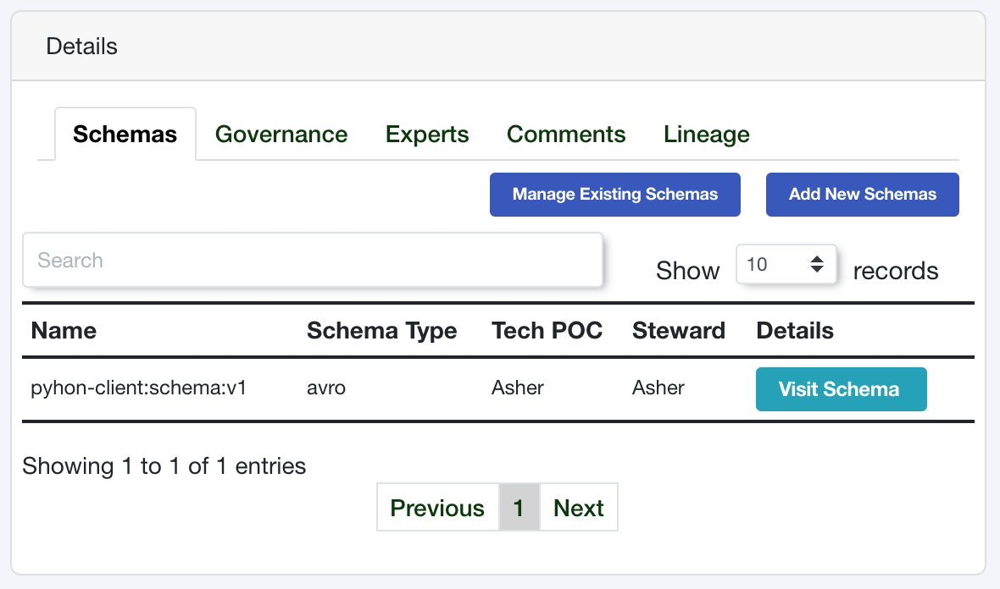
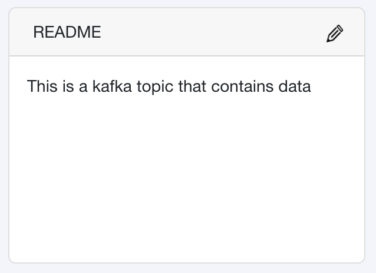

Data Schemas
============

Data Schemas are the heart and soul of a Data Catalog. 
They describe the shape, structure and format of the data. 
You may typically have data schemas represented as a table, a 
JSON or Parquet file, or an Excel sheet but a Data Schema is 
really just a reference to a structured set of fields.


Create a Data Schema
--------------------

Similarly to a data store, creating a data schema can be done by passing 
an object with the required fields. 

.. code-block:: python

   from treeschema import TreeSchema
   ts = TreeSchema('<your email>', '<your secret key>')

   data_store = ts.data_store(1)
   
   my_schema_obj = {
      'name': 'pyhon-client:schema:v1', 
      'type': 'avro',
      'description': 'This is a kafka topic that contains data'
   }
   new_schema = data_store.schema(my_schema_obj)
   new_schema
   # DataSchema(
   #   data_schema_id: 1,
   #   name: pyhon-client:schema:v1,
   #   type: avro,
   #   schema_loc: pyhon-client:schema:v1,
   #   created_ts: 2020-10-06 14:13:59,
   #   updated_ts: 2020-10-06 14:13:59,
   #   description_markup: None,
   #   description_raw: None,
   #   steward: TreeSchemaUser(Asher),
   #   tech_poc: TreeSchemaUser(Asher)
   # )


After running this the schema will now exist in the data store.



A description was also provided for this schema which will show up in the 
README section of the schema details:




Required Fields to Create Data Schema
`````````````````````````````````````
The required fields are managed by the API, all required fields for data 
schemas can be found in BODY of the the API to 
`Create a Data Schema <https://developer.treeschema.com/rest-api/#create-a-schema>`_


Get Data Schemas
----------------

Since schemas reside within a data store you must first retrieve your 
data store and then you can retrieve all schemas within the data store.

.. code-block:: python

   from treeschema import TreeSchema
   ts = TreeSchema('<your email>', '<your secret key>')

   ts.data_store(1).get_schemas()

   # or 

   data_store = ts.data_store(1)
   data_store.get_schemas()

   
You can retrieve data schema by the ID or the name of the schema.
The name is not case senstive but the spelling does need to be exact!

.. code-block:: python

   schema = data_store.schema(1)
   schema = data_store.schema('my_schema')

.. note:: If when you are getting schemas from your data store, the first time that 
      you get a schema all of the schemas for the given data store will be pre-fetched,
      this allows access to subsequent schemas in this data store to be access from 
      a local cache


Add Tags to a Schema
--------------------

You can add tags by passing in a single value or a list of values to `add_tags()`

.. code-block:: python

   schema = ts.data_store(1).schema(1)
   schema.add_tags('new tag')
   schema.add_tags(['multi tag', 'another tag'])


Updating Schemas
----------------

Schemas can be updated with keyword arguments. All of the possible 
arguments are defined in the `update schema <../api/treeschema.catalog.data_schema.html#treeschema.catalog.data_schema.DataSchema.update>`_
documentation. You can change as many of the attributes as you'd 
like at once but you only need to change one value to make the update.

You can also pass in `TreeSchemaUser` objects to update the steward 
or technical point of contact.

.. code-block:: python

   schema = ts.data_store(1).schema(1)
   schema
   # DataSchema(
   #  data_schema_id: 1,
   #  name: DS1,
   #  type: view,
   #  schema_loc: DS1,
   #  created_ts: 2021-01-29 14:39:10,
   #  updated_ts: 2021-02-01 12:37:43,
   #  description_markup: <p>New Schema description</p>,
   #  description_raw: New Schema description,
   #  data_store_id: 1,
   #  steward: TreeSchemaUser(Asher),
   #  tech_poc: TreeSchemaUser(Asher)
   # )

   new_poc = ts.user('grant@treeschema.com')

   schema.update(
      _type='avro', 
      description='This is an updated schema',
      tech_poc=new_poc,
      steward=new_poc
   )

   # DataSchema(
   #   data_schema_id: 1,
   #   name: DS1,
   #   type: avro,
   #   schema_loc: DS1,
   #   created_ts: 2021-01-29 14:39:10,
   #   updated_ts: 2021-02-01 17:24:28,
   #   description_markup: <p>This is an updated schema</p>,
   #   description_raw: This is an updated schema,
   #   data_store_id: 1,
   #   steward: TreeSchemaUser(Grant),
   #   tech_poc: TreeSchemaUser(Grant)
   # )

Remove (deprecate) Schemas
--------------------------

You can delete a schema from a data store. Within Tree Schema this 
actually deprecates the schema and does not truly `delete` it.

To remove schemas, create a list of schema objects that should be 
removed and then pass them to the `data_store.delete_schemas()` funciton.

.. code-block:: python

   data_store = ts.data_store(1)
   data_store.get_schemas()

   schema_1 = data_store.schema('remove_schema_1')
   schema_2 = data_store.schema('remove_schema_2')
   schema_3 = data_store.schema('remove_schema_3')

   schemas_to_remove = [schema_1, schema_2, schema_3]

   data_store.delete_schemas(schemas_to_remove)
   # True
