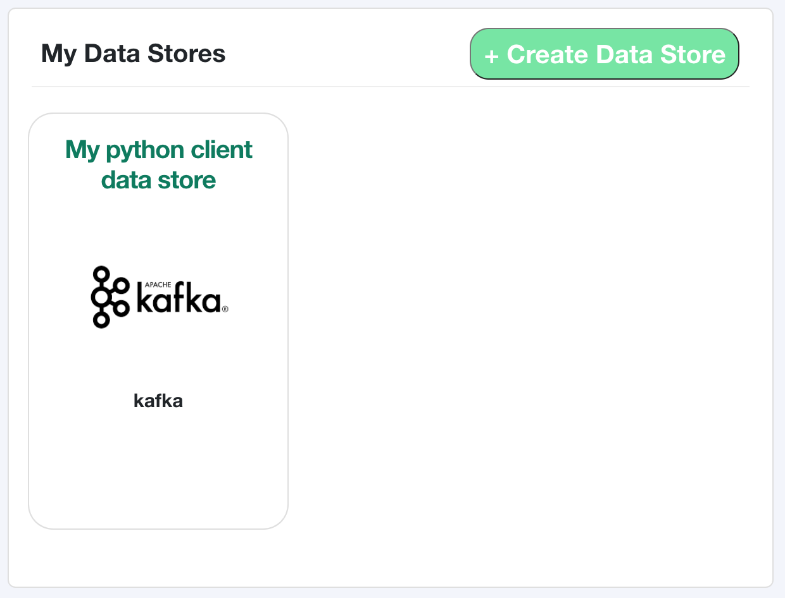
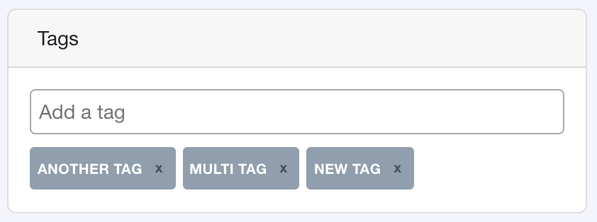

Data Stores
===========

Data Stores are containers for your data. A data store may reference a 
database, a file store, or really anything else - even an email server!

Tree Schema has automated connectors for many data stores that will 
allow Tree Schema to read your metadata and automatically populate 
your data store on your behalf. While you can create a data store 
from the Python client you can only create the automated connection 
from the Tree Schema GUI. 

If you do create a data store from the Python client you can always 
add the connection later in the GUI!


Create a Data Store
-------------------

Creating a data store is as simple as passing in a dictionary of the required fields (defined below).
The function will attempt to create a data store in Tree Schema, but if a data store 
already exists with the same name then the existing data store will be returned.

This makes execution of this funciton work well in CICD pipelines where you may 
be passing in the same values over and over. You can define your data store once and 
then create different schemas or fields when you deploy your code.

.. code-block:: python

   from treeschema import TreeSchema
   ts = TreeSchema('<your email>', '<your secret key>')

   my_ds_obj = {'name': 'My python client data store', 'type': 'kafka'}
   data_store = ts.data_store(my_ds_obj)

   data_store 
   # DataStore(
   #   data_store_id: 1,
   #   name: My python client data store,
   #   type: kafka,
   #   other_type: None,
   #   created_ts: 2020-10-06 14:05:15,
   #   updated_ts: 2020-10-06 14:05:15,
   #   description_markup: None,
   #   description_raw: None,
   #   steward: TreeSchemaUser(Asher),
   #   tech_poc: TreeSchemaUser(Asher),
   #   details: {}
   # )


After running this you can check Tree Schema and see your data store:





Required Fields to Create Data Store 
````````````````````````````````````
The required fields are managed by the API, all required fields for data 
stores can be found in BODY of the the API to 
`Create a Data Store <https://developer.treeschema.com/rest-api/#create-a-data-store>`_


Get Data Stores
---------------

Retrieve all data stores in your organization.

.. code-block:: python

   from treeschema import TreeSchema
   ts = TreeSchema('<your email>', '<your secret key>')

   ts.get_data_stores()
   
You can retrieve data stores by passing in the ID or the name of the data store. 
The name is not case senstive but the spelling does need to be exact!

.. code-block:: python

   data_store = ts.data_store(1)
   data_store = ts.data_store('My Data Store')

.. note:: The first time you retrieve a data store will take slightly longer than 
      subsequent data store retrievals - the initial request pre-fetches all of your 
      data stores and subsequent access happens within your local cache


Manage Tags for a Data Store
----------------------------

By default, Tree Schema lazily loads tags. You can retrieve the tags for a data store with 
the `data_store.tags` property:

.. code-block:: python

   data_store = ts.data_store(1)
   data_store.tags
   # ['ds tag', 'marketing', 'conversion', 'pii', 'api tag']


You can add tags by passing in a single value or a list of values to `add_tags()`:

.. code-block:: python

   data_store = ts.data_store(1)
   data_store.add_tags('new tag')
   data_store.add_tags(['multi tag', 'another tag'])


This can be viewed within the Tree Schema GUI:




Similarly, you can remove tags with the `remove_tags()` function:


.. code-block:: python

   data_store = ts.data_store(1)
   data_store.remove_tags('remove tag')
   data_store.remove_tags(['remove multi tag', 'another tag'])


