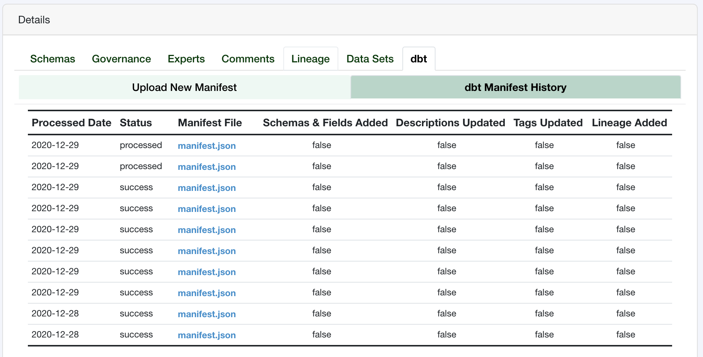

dbt Integration
===============

Tree Schema is able to automatically extract the metadata from your dbt manifest.json file. 
Processing this manifest file from dbt allows you to create or update schemas, fields, descriptions and 
tags. Tree Schema is also able to use the schema-to-schema data lineage provided by dbt and 
to infer the field level data lineage that occurs between your schemas.

A more in-depth overview of the Tree Schema / dbt integration can be found in 
the `Tree Schema documentation <https://help.treeschema.com/dbt/dbt.html>`_.

The dbt Manager
---------------

Tree Schema provides a **dbt** object with each data store. This object is responsible 
for handling all of the manifest file integrations. 

.. code-block:: python

   from treeschema import TreeSchema
   ts = TreeSchema('<your email>', '<your secret key>')

   data_store = ts.data_store(1)
   data_store.dbt

Parse a Manifest File
---------------------

The first step to having Tree Schema process your manifest file is to upload 
it to Tree Schema. You can pass in the location of a file (if the file is 
available on the same machine) or you can pass the content of your manifest file as bytes.
After the file is successfully parsed you can review the output before saving 
the metadata to Tree Schema.

.. code-block:: python

   from treeschema import TreeSchema
   ts = TreeSchema('<your email>', '<your secret key>')

   data_store = ts.data_store(1)

   # Send the manifest to Tree Schema to be parsed
   data_store.dbt.parse_dbt_manifest('./manifest.json')
   

Similarly, the contents of the file can be provided if the file is on S3 or 
another external server:

.. code-block:: python

   from treeschema import TreeSchema
   ts = TreeSchema('<your email>', '<your secret key>')

   data_store = ts.data_store(1)

   # Read the file as bytes 
   # (reading a local file here but the same applies to S3, etc.)
   with open('./target/manifesst.json', 'rb') as f:
       manifest = f.read()

   data_store.dbt.parse_dbt_manifest(manifest)
   

Get the Status of a Parsed Manifest
-----------------------------------

Parsing of manifest files happens asynchronously, therefore you will need to wait for 
the processing to complete before the manifest can be saved. You can check the status 
of the manifest at any time.

.. code-block:: python

   from treeschema import TreeSchema
   ts = TreeSchema('<your email>', '<your secret key>')

   data_store = ts.data_store(1)
   data_store.dbt.parse_dbt_manifest('./manifest.json')
   
   # Get the status of a parse instance
   ds.dbt.get_manifest_parse_status()
   
For convenience, a waiter has been built in that will continue to check the status of
the parse instance until it completes. Please note that completion may occur because 
of a successful parse or because of an error.

.. code-block:: python

   from treeschema import TreeSchema
   ts = TreeSchema('<your email>', '<your secret key>')

   data_store = ts.data_store(1)
   data_store.dbt.parse_dbt_manifest('./manifest.json')
   
   # Get the status of a parse instance - returns the final state
   ds.dbt.wait_for_parse_complete()
   # parsed

Submit and Save the Manifest
----------------------------

Once a manifest file is in the **parsed** state you can submit it to be saved. There 
are four options you can specify when saving the manifest content:

* **add_schemas_fields**: Whether or not to add the schemas and fields from the manifest to Tree Schema

* **update_descriptions**: Whether or not to update the descriptions for the existing schema and field assets in Tree Schema

* **update_tags**: Whether or not to add tags for the schema and field assets from the manifest into Tree Schema

* **add_lineage**: Whether or not to add data lineage from the manifest into Tree Schema

.. note::

   We suggest that you set **add_schemas_fields** to **False** and to use the automated metadata crawling built into Tree Schema to first identify your schemas and fields before you upload a manifest file. This will ensure that any automation built into Tree Schema that requires specific, case-sensitive, naming matches the values in the underlying database. Similarly, we also suggest only setting **update_descriptions** to **True** if you are bootstrapping your Tree Schema catalog with documentation. Otherwise any descriptions that have previously been updated in Tree Schema will be overridden.

.. code-block:: python

   from treeschema import TreeSchema
   ts = TreeSchema('<your email>', '<your secret key>')

   data_store = ts.data_store(1)
   data_store.dbt.parse_dbt_manifest('./manifest.json')
   
   # Get the status of a parse instance - returns the final state
   ds.dbt.wait_for_parse_complete()

   # Save the results
   ds.dbt.save_parse_results(
       add_schemas_fields=False,
       update_descriptions=False,
       update_tags=True,
       add_lineage=True
   )

View Historical Manifest Processes
----------------------------------

You can view the historical processing of your manifest files under the **dbt** tab 
for the given data store.

View Parsed Manifest Content
----------------------------

You have the option to review the content of the parsed dbt manifest file 
after parsing and before you save it. Once you a parsed instance of a dbt file 
has completed you can access the schemas and lineage through the **parsed_schemas** and 
**parsed_lineage** attributes, respectively.

.. code-block:: python

   from treeschema import TreeSchema
   ts = TreeSchema('<your email>', '<your secret key>')

   data_store = ts.data_store(1)
   data_store.dbt.parse_dbt_manifest('./manifest.json')
   
   # Get the status of a parse instance - returns the final state
   ds.dbt.wait_for_parse_complete()
   ds.dbt.parsed_schemas
   # [
   #    {
   #         'schema_name': 'TS_SCHEMA1.cust_mkt_segment',
   #         'schema_type': 'view',
   #         'schema_status': 'exists'
   #    },
   #    {
   #         'schema_name': 'TS_SCHEMA1.cust_sale_facts',
   #         'schema_type': 'table',
   #         'schema_status': 'exists'
   #     },
   #     ...
   # ]

   ds.dbt.parsed_lineage
   # [
   #      {
   #          'source_schema_name': 'TS_SCHEMA1.item_sales',
   #          'target_schema_name': 'TS_SCHEMA1.cust_sale_facts'
   #      },
   #      {
   #          'source_schema_name': 'TS_SCHEMA1.cust_raw',
   #          'target_schema_name': 'TS_SCHEMA1.cust_sale_facts'
   #      },
   #      ...
   #  ]

Similarly, if there is an error you can view it with the **parse_error** attribute:

.. code-block:: python

   ds.dbt.parse_error
