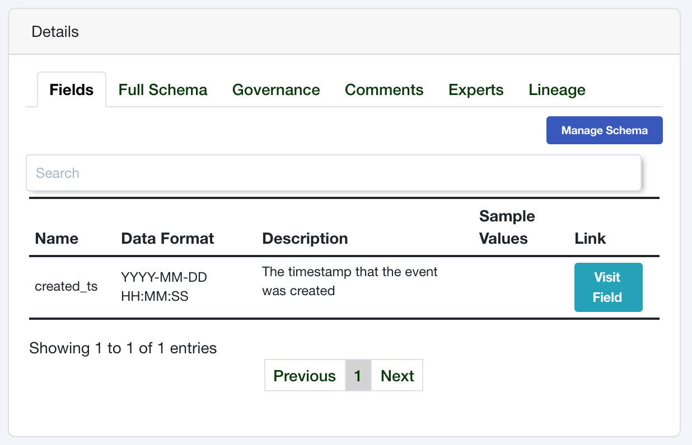
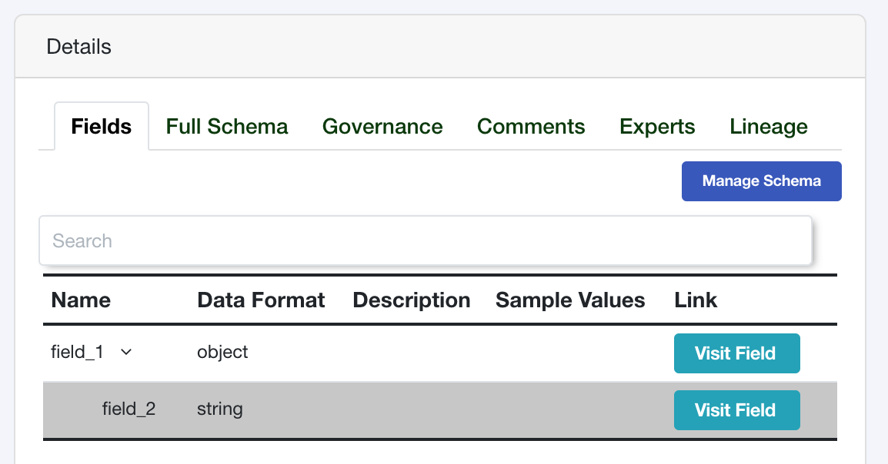
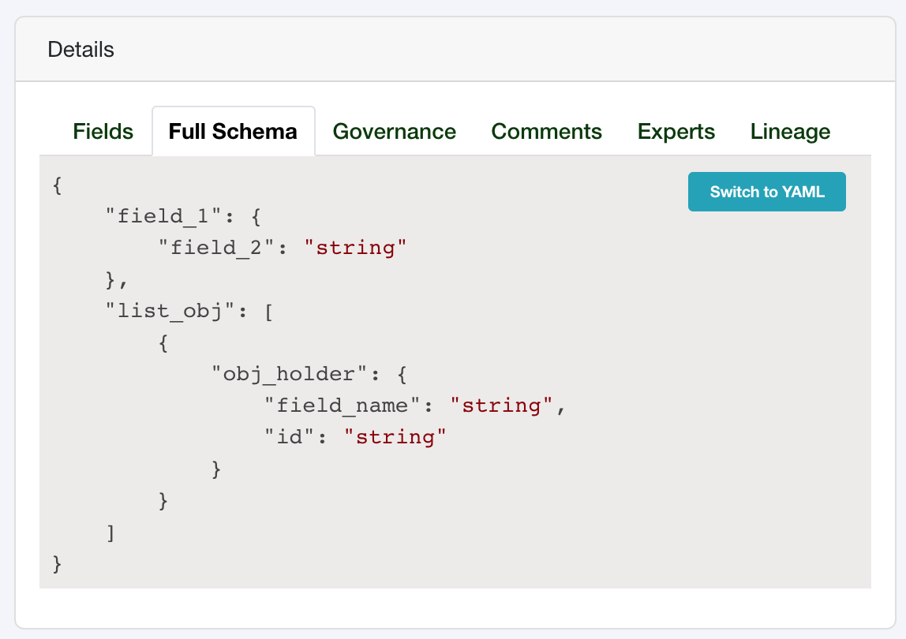

Data Fields
===========

Data Fields are the most granular part of your catalog that describes 
the format and data type of our underlying data. Whether your Fields 
are represented as columns in a table, keys in JSON file, or Structs 
in a distributed Parquet data set you can capture their meaning and 
definition with Tree Schema Fields.


Create a Field
--------------

Similarly to a data store and data schema, creating a data field can be done by passing 
an object with the required fields. 


.. code-block:: python

   from treeschema import TreeSchema
   ts = TreeSchema('<your email>', '<your secret key>')

   schema = ts.data_store(1).schema(1)
   
   my_field_obj = {
      'name': 'created_ts', 
      'type': 'scalar',
      'data_type': 'string',
      'data_format': 'YYYY-MM-DD HH:MM:SS',
      'description': 'The timestamp that the event was created'
   }
   new_field = schema.field(my_field_obj)

   new_field 
   # DataField(
   #   field_id: 1,
   #   name: created_ts,
   #   parent_path: None,
   #   full_path_name: created_ts,
   #   type: scalar,
   #   data_type: string,
   #   data_format: YYYY-MM-DD HH:MM:SS,
   #   nullable: True,
   #   created_ts: 2020-10-06 14:53:47,
   #   updated_ts: 2020-10-06 14:53:47,
   #   description_markup: <p>The timestamp that the event was created</p>,
   #   description_raw: The timestamp that the event was created,
   #   steward: TreeSchemaUser(Asher),
   #   tech_poc: TreeSchemaUser(Asher)
   # )


After running this the field will now exist in the data schema which can be seen in the Tree Schema GUI:





Infer Data Field Types from Native Python Types
```````````````````````````````````````````````
Data Fields can be created with as little as just the `name` and `type` fields in the dictionary 
that is used to create the field: 

.. code-block:: python

   my_field_obj = {'name': 'another_field', 'type': str} 
   new_field = schema.field(my_field_obj)
   # DataField(
   #   field_id: 116,
   #   name: another_field,
   #   parent_path: None,
   #   full_path_name: another_field,
   #   type: scalar,
   #   data_type: string,
   #   data_format: str,
   #   nullable: True,
   #   created_ts: 2020-10-10 17:09:49,
   #   updated_ts: 2020-10-10 17:09:49,
   #   description_markup: None,
   #   description_raw: None,
   #   steward: TreeSchemaUser(Asher),
   #   tech_poc: TreeSchemaUser(Asher)
   # )

There are other required fields for the underlying REST API, as described below, 
but in order to have the `treeschema` client infer the values of ther other 
required fields (e.g. `data_type` and `data_format`) you must pass in one 
of the native python types: `str`, `int`, `float`, `bool`, `bytes`, `list` or `dict`.

The client is able to infer that `str` is a scalar with a data type of string, 
however, if you pass `scalar` for the type then it is unable to infer the data type.

Note - passing in the native python type will create the `data_format` as the literal 
name of the type, as seen above.

Required Fields to Create Data Field
````````````````````````````````````
The fields that can be sent to Tree Schema are managed by the API, 
all required fields for data fields can be found in BODY of the the API to 
`Create a Field <https://developer.treeschema.com/rest-api/#create-a-field>`_


Create Fields Embedded in Other Fields
``````````````````````````````````````

If you are using JSON, Avro, Parquet, or other types of structs then you 
may have fields embedded within other fields, for example:


.. code-block:: json

   {
      "field_1": {
         "field_2": 1,
         "field_3": []
      }
   }

In this example, `field_1` is an `object` and within it there are two other fields:
`field_2` and `field_3`. Tree Schema natively supports objects, lists and scalar 
fields!

You can use dot notation to define parent / child relationships, if the parent
field does not exist it will be created as an `object` by default. 

.. code-block:: python

   from treeschema import TreeSchema
   ts = TreeSchema('<your email>', '<your secret key>')

   schema = ts.data_store(1).schema(1)
   
   # When you create a child field and the parent field does 
   # not already exist, the "type" will refer to the field 
   # type of the child field and the parent will be created 
   # as an object
   my_field_obj = {
      'name': 'field_1.field_2', 
      'type': 'scalar',
      'data_type': 'string',
      'data_format': 'string'
   }
   new_field = schema.field(my_field_obj)

The parent / child relationship can be seen and expanded within the Tree Schema GUI:




Some of your schemas may lists of objects, Tree Schema can handle this as well! 
To create a data schema that has a list of objects you need to fist create 
your parent field that is the type `list`, then you can add objects within it:


.. code-block:: python

   # Define the list field
   # Note - the field type is list but "array" is used for the data format
   #  to prevent semantic overlap between the fields
   list_obj = {
      'name': 'list_obj', 
      'type': 'list',
      'data_type': 'array',
      'data_format': 'list (object)'
   }
   list_field = schema.field(list_obj)

   # Add an object to the list using dot notation
   obj_holder = {
      'name': 'list_obj.obj_holder', 
      'type': 'object',
      'data_type': 'object',
      'data_format': 'my object'
   }
   obj_field = schema.field(obj_holder)

   # Add fields to the object
   field_name = {
      'name': 'list_obj.obj_holder.field_name', 
      'type': 'scalar',
      'data_type': 'string',
      'data_format': 'string'
   }
   name_field = schema.field(field_name)

   field_id = field_name.copy()
   field_id['name'] = 'list_obj.obj_holder.id'
   id_field = schema.field(field_id)


Now, when looking at an alternative layout, Tree Schema shows the full schema 
with all of the embedded objects and lists of objects that have been created.




Get Data Fields
---------------

Data fields reside within a data schema so you must first retrieve your 
data store then your schema and then you can retrieve all fields
that exist within the schema.

.. code-block:: python

   from treeschema import TreeSchema
   ts = TreeSchema('<your email>', '<your secret key>')

   fields = ts.data_store(1).schema(1).get_fields()

   # or 

   schema = ts.data_store(1).schema(1)
   schema.get_fields()

   
You can retrieve field by the field ID or the name of the field.
The name is not case senstive but the spelling does need to be exact!

.. code-block:: python

   field = ts.data_store(1).schema(1).field(1)
   field = ts.data_store('My Data Store').schema(2).field('my_field')

.. note:: The first time you retrieve a field will take slightly longer than 
      subsequent field retrievals - the initial request pre-fetches all of 
      the fields within the given schema and subsequent access happens 
      within your local cache


Manage Tags for a Field
-----------------------

By default, Tree Schema lazily loads tags. You can retrieve the tags for a field with 
the `field.tags` property:

.. code-block:: python

   field = ts.data_store(1).schema(1).field(1)
   field.tags
   # ['field tag', 'marketing', 'conversion', 'pii', 'api tag']


You can add tags by passing in a single value or a list of values to `add_tags()`:

.. code-block:: python

   field = ts.data_store(1).schema(1).field(1)
   field.add_tags('new tag')
   field.add_tags(['multi tag', 'another tag'])


Similarly, you can remove tags with the `remove_tags()` function:


.. code-block:: python

   field = ts.data_store(1).schema(1).field(1)
   field.remove_tags('remove tag')
   field.remove_tags(['remove multi tag', 'another tag'])


Updating Fields
---------------

Fields can be updated with keyword arguments. All of the possible 
arguments are listed below, you can change as many as you'd 
like at once but you only need to change one value to make the update.

You can also pass in `TreeSchemaUser` objects to update the steward 
or technical point of contact.

.. code-block:: python

   field = ts.data_store(1).schema(1).field(1)
   field
   # DataField(
   #   field_id: 1,
   #   name: FIRST_NAME,
   #   parent_path: None,
   #   full_path_name: FIRST_NAME,
   #   type: scalar,
   #   data_type: string,
   #   data_format: VARCHAR2,
   #   nullable: False,
   #   created_ts: 2020-08-15 17:16:11,
   #   updated_ts: 2020-08-15 17:16:11,
   #   description_markup: None,
   #   description_raw: None,
   #   steward: TreeSchemaUser(Grant Seward),
   #   tech_poc: TreeSchemaUser(Grant Seward)
   # )

   new_poc = ts.user('asher@treeschema.com')

   field.update(
      _type='object', 
      data_type='object',
      data_format='json',
      description='This is an updated field',
      nullable=False,
      tech_poc=new_poc,
      steward=new_poc
   )

   field
   # DataField(
   #   field_id: 1,
   #   name: FIRST_NAME,
   #   parent_path: None,
   #   full_path_name: FIRST_NAME,
   #   type: object,
   #   data_type: object,
   #   data_format: json,
   #   nullable: False,
   #   created_ts: 2020-08-15 17:16:11,
   #   updated_ts: 2020-10-05 23:22:42,
   #   description_markup: <p>This is an updated field</p>,
   #   description_raw: This is an updated field,
   #   steward: TreeSchemaUser('Asher'),
   #   tech_poc: TreeSchemaUser('Asher')
   # )


Remove (deprecate) a Field
--------------------------

You can delete a field from a schema. Within Tree Schema this 
actually deprecates the field and does not truly `delete` it.

To remove fields, create a list of field objects that should be 
removed and then pass them to the `schema.delete_fields()` funciton.

.. code-block:: python

   schema = ts.data_store(1).schema(1)
   schema.get_fields()

   field_1 = schema.field('remove_field_1')
   field_2 = schema.field('remove_field_2')
   field_3 = schema.field('remove_field_3')

   fields_to_remove = [field_1, field_2, field_3]

   schema.delete_fields(fields_to_remove)
   # True

