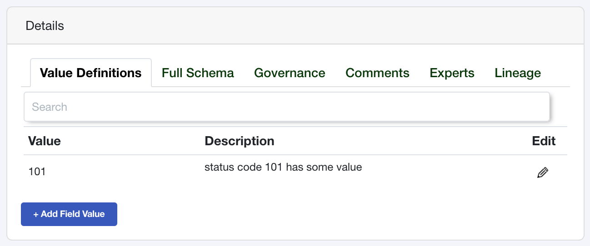

Sample Values
=============

Sample values, or field values, are just that, values (and descriptions). 
They allow you to capture and define the specific value of a field. 
Perhaps your data analysts want to know what the value `01` means 
for your `customer_status` or when how value `NEW` differs 
between new customers and new leads. 

Using the Tree Schema API is a great way to capture these values 
and their meanings directly in your code where the data is created.


Create a Sample Value
---------------------

Similarly to a data stores, data schemas and fields, creating a 
sample value can be done by passing an object with the required fields. 

.. code-block:: python

   from treeschema import TreeSchema
   ts = TreeSchema('<your email>', '<your secret key>')

   field = ts.data_store(1).schema(1).field('my_field')
   
   sample_value = {
      'field_value': '101',
      'description': 'status code 101 has some value'
   }
   new_value = field.field_value(sample_value)

   new_value
   # FieldValue(
   #   field_value_id: 1,
   #   field_value: 101,
   #   created_ts: 2020-10-06 15:17:13,
   #   updated_ts: 2020-10-06 15:17:13,
   #   description_markup: <p>status code 101 has some value</p>,
   #   description_raw: status code 101 has some value
   # )


After running this the sample value will now exist in the field.





Required Fields to Create a Sample Value
````````````````````````````````````````
The required fields are managed by the API, all required fields for  
sample values can be found in BODY of the the API to 
`Create a Field Value <https://developer.treeschema.com/rest-api/#create-a-field-value>`_


Get Field Values
----------------

Field values reside within a data fields so you must first retrieve your 
data store, then your schema and your field then you can retrieve all 
sample values that exist within the field.

.. code-block:: python

   from treeschema import TreeSchema
   ts = TreeSchema('<your email>', '<your secret key>')

   field_values = ts.data_store(1).schema(1).field(1).get_field_values()

   # or 

   field = ts.data_store(1).schema(1).field(1)
   field.get_field_values()

   
You can retrieve sample value by it's ID or the actual field value.
The field value is not case senstive but the spelling does need to be exact!

Make sure you always pass a string for your sample value, even if the 
actual sample value is a number like 101.

.. code-block:: python

   sample = ts.data_store(1).schema(1).field(1).sample_value(1)
   sample = ts.data_store('My Data Store').schema(2).field('my_field').sample_value('101')


Update a Field Value
--------------------

Descriptions for sample values may change over time, you can update 
the description or the actual field value. When updating 
the field value you must pass keyword arguments. You can pass 
as many as you would like but only one is required in order to
make an update

.. code-block:: python

   field_value = ts.data_store(1).schema(1).field(1).field_value('101')
   field_value
   # FieldValue(
   #   field_value_id: 16330,
   #   field_value: 101,
   #   created_ts: 2020-10-05 23:02:34,
   #   updated_ts: 2020-10-05 23:02:34,
   #   description_markup: <p>status code 101 has some value</p>,
   #   description_raw: status code 101 has some value
   # )
   
   field_value.update(field_value='202', description='The status is now 202')
   field_value
   # FieldValue(
   #   field_value_id: 16330,
   #   field_value: 202,
   #   created_ts: 2020-10-05 23:02:34,
   #   updated_ts: 2020-10-05 23:02:34,
   #   description_markup: <p>The status is now 202</p>,
   #   description_raw: The status is now 202
   # )


