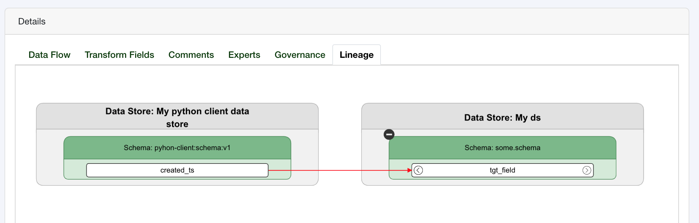
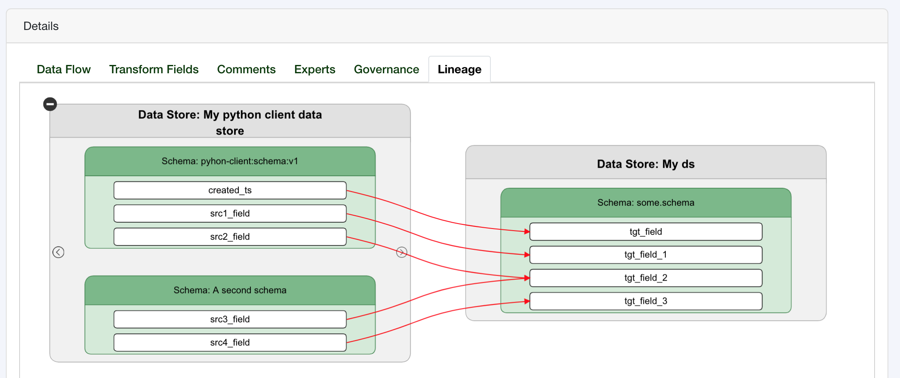

Transformation Links & Data Lineage
===================================

Transformation links are the granular field to field data movements that occur 
when you data moves, whether that is from a SQL trigger, batch ELT / ETL or a 
lift and shift data movement.

To create a transformation links you need to define a source field and a target field.
One or more transformation links can then be added to the a transformation.

Create a Transformation Link
----------------------------

There are two ways that a transformation link can be created:

1. **Using `DataField` objects**: This is the recommended method when interacting 
   with the Tree Schema client. It is easier to define transformation links and 
   it will enable better backwards compatibility going forward.

2. **Using the `field_id` from the source and target field**: You may want 
   to use the `field_id` directly if you know the value and you want to 
   reduce the overhead from the REST API to look up the data field information
   which requires several API calls to get data stores, then schemas, etc.

Creating Links with Data Fields
-------------------------------

To create a link with data fields you need to pass in a tuple (or list) of 
source fields and target fields:

.. code-block:: python

   from treeschema import TreeSchema
   ts = TreeSchema('<your email>', '<your secret key>')

   # Define the fields 
   src_field = ts.data_store(1).schema(1).field(1)
   tgt_field = ts.data_store('My ds').schema('some.schema').field('tgt_field')
   link_obj = (src_field, tgt_field)

   t = ts.transformation(1)
   t.create_links(link_obj)

Which creates a single link inside Tree Schema:

Similarly, more than one source and target field can be passed at a time. Whenever 
you plan to get more than one field from a schema it is more efficient to call 
`get_fields()` first to prefect the fields before accessing them individually.

.. code-block:: python

   from treeschema import TreeSchema
   ts = TreeSchema('<your email>', '<your secret key>')

   # Define the fields 
   src_schema_1 = ts.data_store(1).schema(1)
   src_schema_2 = ts.data_store(1).schema('A second schema')

   tgt_schema = ts.data_store('My ds').schema('some.schema')

   # Force a refresh from Tree Schema, updating the local cachce
   _ = [s.get_fields(refresh=True) for s in [src_schema_1, src_schema_2, tgt_schema]]

   link_objs = [
      (src_schema_1.field('src1_field'), tgt_schema.field('tgt_field_1')),
      (src_schema_1.field('src2_field'), tgt_schema.field('tgt_field_2')),
      (src_schema_2.field('src3_field'), tgt_schema.field('tgt_field_2')),
      (src_schema_2.field('src4_field'), tgt_schema.field('tgt_field_3'))
   ]
   
   t = ts.transformation(1)
   t.create_links(link_objs)

We reused the same transfomation as before, but now we've added additional links:

Creating Links with Field IDs
-----------------------------

The same basic principles apply when creating links with field IDs.
You can still submit one link at a time or you can submit a list of 
links to create. The only difference is that the field IDs must be 
passed in a source-to-target mapping:

.. code-block:: python

   from treeschema import TreeSchema
   ts = TreeSchema('<your email>', '<your secret key>')

   link_obj = {'source_field_id': 1, 'target_field_id': 200}

   t = ts.transformation(1)
   t.create_links(link_obj)

And with a list of objects:

.. code-block:: python

   from treeschema import TreeSchema
   ts = TreeSchema('<your email>', '<your secret key>')

   link_objs = [
      {'source_field_id': 1, 'target_field_id': 200},
      {'source_field_id': 3, 'target_field_id': 400},
      {'source_field_id': 5, 'target_field_id': 500}
   ]
   
   t = ts.transformation(1)
   t.create_links(link_objs)