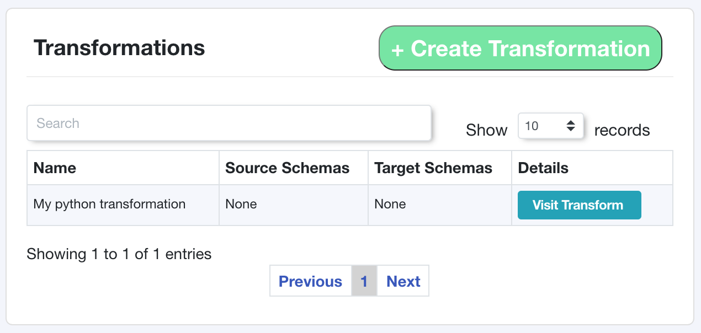

Transformations
===============


Transformations describe how data moves in in your ecosystem. By themselves, they are just 
holders, but once you add transformation links to your transformation you will 
be able to build your data lineage.


Create a transformation
-----------------------

Creating a transformation can be done by passing in a dictionary of the required fields.
The function will attempt to create a transformation in Tree Schema, but if a transformation
already exists with the same name then the existing transformation will be returned.


.. code-block:: python

   from treeschema import TreeSchema
   ts = TreeSchema('<your email>', '<your secret key>')

   my_transform = {'name': 'My python transformation', 'type': 'pub_sub_event'}
   t = ts.transformation(my_transform)


After running this you can check Tree Schema and see your transformation:





Required Fields to Create a Transformation
```````````````````````````````````````````

The required fields are managed by the API, all required fields for  
transformations can be found in BODY of the the API to 
`Create a Transformation <https://developer.treeschema.com/rest-api/#create-a-transformation>`_


Get Transformations
-------------------

Retrieve all transformations in your organization. If you are planning to 
interact with more than one transformation it will be more efficient 
to call `get_transformations()` first and then access each transformation 
independently.

.. code-block:: python

   from treeschema import TreeSchema
   ts = TreeSchema('<your email>', '<your secret key>')

   ts.get_transformations()
   
You can retrieve transformations by passing in the ID or the name of the transformation. 
The name is not case senstive but the spelling does need to be exact!

.. code-block:: python

   t = ts.transformation(1)
   t = ts.transformation('My Transform')


Manage Tags for a Transformation
--------------------------------

By default, Tree Schema lazily loads tags. You can retrieve the tags for a transformation with 
the `transformation.tags` property:

.. code-block:: python

   t = ts.transformation(1)
   t.tags
   # ['transform tag', 'marketing', 'conversion', 'pii', 'api tag']


You can add tags by passing in a single value or a list of values to `add_tags()`:

.. code-block:: python

   t = ts.transformation(1)
   t.add_tags('new tag')
   t.add_tags(['multi tag', 'another tag'])


Similarly, you can remove tags with the `remove_tags()` function:

.. code-block:: python

   t = ts.transformation(1)
   t.remove_tags('remove tag')
   t.remove_tags(['remove multi tag', 'another tag'])

