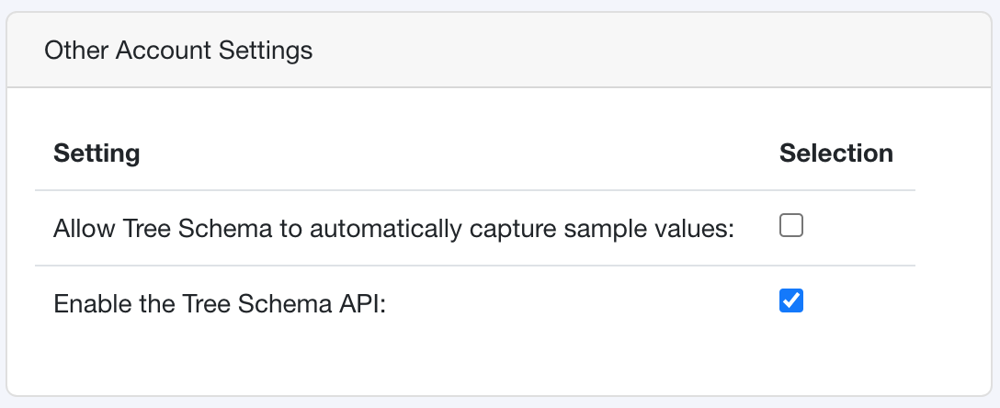
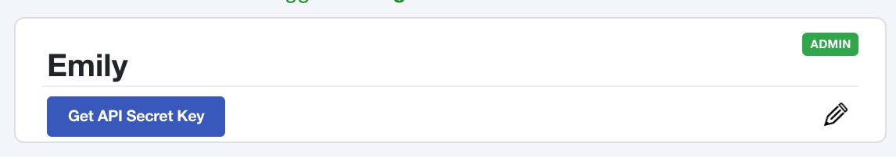
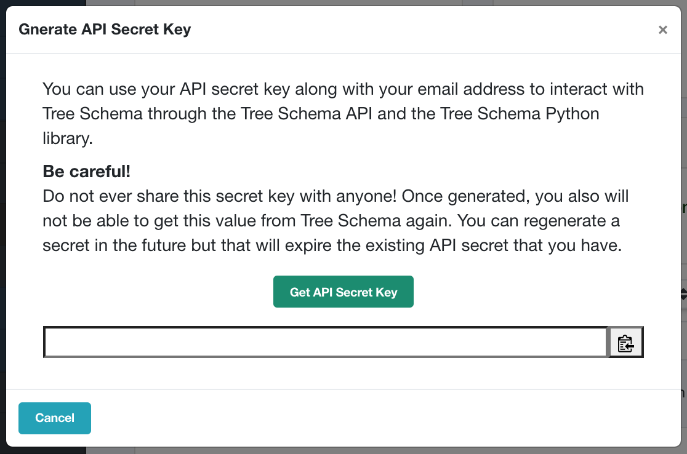

Tree Schema Secret Key
======================

In order to use the Tree Schema Python client you must first: 

1. Enable API access for your organization and, 
2. Generate an API secret key.

Enable the Tree Schema API
--------------------------

By default, the API is not activated for your organization. In order to enable the API an admin in the organization must select the **"Enable the Tree Schema API"** option under **Other Account Settings** in the Admin portal.

Generate an API Secret Key
--------------------------

The API secret key is unique to your user. Do not share it with anyone. The secret key is used in the headers of the REST API to authenticate you.

To generate a new secret key navigate to the **My Profile** section and select **Get API Key**

If you organization has enabled the Tree Schema API, a modal will be displayed. From here you can retrieve a new secret key.

.. note:: After you generate your API secret the value will never be shown again and you will not be able to retrieve it from Tree Schema. You only have one opportunity to save it! Don't worry, you can always generate a new key - but this will deactivate your previous key.

